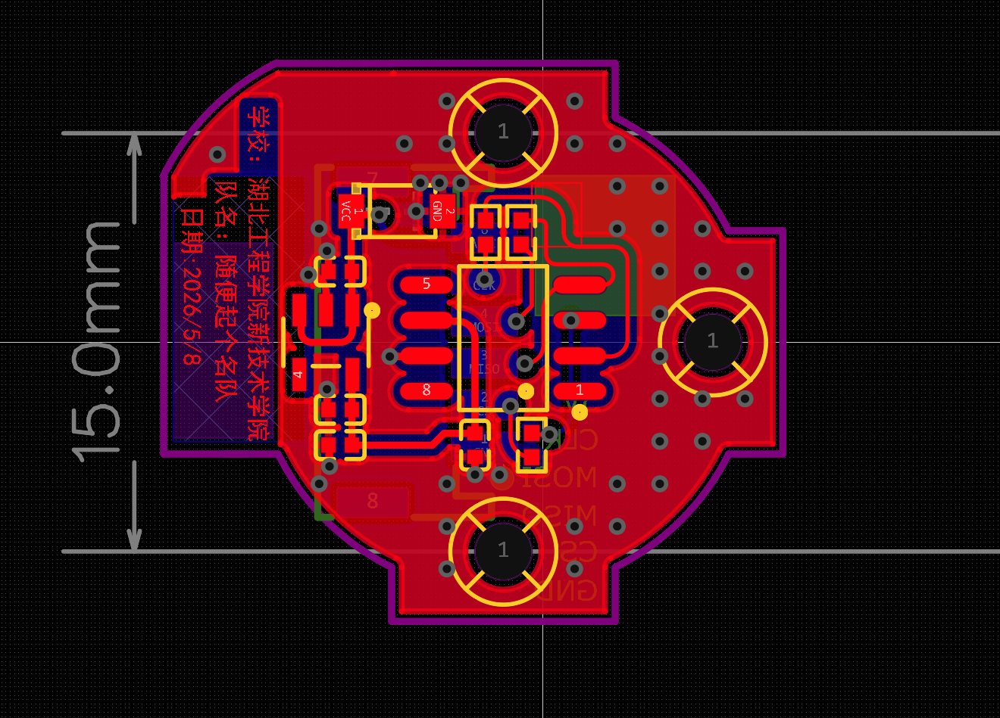

# 自平衡智能车硬件设计

用于全国大学生智能汽车竞赛单车定向组的自平衡智能车硬件工程。

## 项目概述

本项目采用多板协同架构，包括 TC264 主板、TC264 核心板、无刷电机驱动板和磁编码器板。

整车实现低速八字绕圈稳定运行，直线速度达 **8.8 m/s**。
## 硬件板卡介绍

### 1. TC264 主板

- 尺寸约 88 × 51 mm，作为 TC264 核心板扩展底板。
- 集成双路 5 V BUCK、3.3 V LDO、独立舵机电源、电源开关和电池电压检测。
- 提供无线 UART/SPI、定位、屏幕、姿态传感器、按键和拨码接口。
- 负责整车供电分配和外设扩展。
- 

### 2. TC264 核心板

- 尺寸约 44 × 52 mm，基于英飞凌 TC264。
- 包含最小系统、时钟、复位、下载调试和高密度 I/O 引出。
- 作为整车主控，负责多板通信和传感器数据处理。

### 3. 无刷电机驱动板

- 以 CYT2BL3CA 为控制核心，采用三相栅极驱动与 6 颗 TPN2R703NL MOS 构建三相半桥。
- 配置 B5819WS 自举电路、SMAJ16CA TVS 防护和大容量输入去耦。
- 使用双路 RY9121E 生成 5 V 和 3.3 V，并支持电池电压检测。
- 用于无刷电机 BLDC/FOC 控制与主板通信。

### 4. 磁编码器板

- 尺寸 15 × 15 mm，基于 TLE5012BE1000 实现 360° 绝对角度测量。
- 采用 RT9013-33GB 独立供电，并配置 SPI 串联匹配电阻。
- 增加 BZT52C5V1 接口防护，提高户外使用可靠性。
- 用于采集车把角度，支撑自平衡转向闭环控制。

## 工程打开方式

1. 安装嘉立创 EDA Pro。
2. 下载对应的 `.epro2` 文件。
3. 使用嘉立创 EDA Pro 打开工程。
